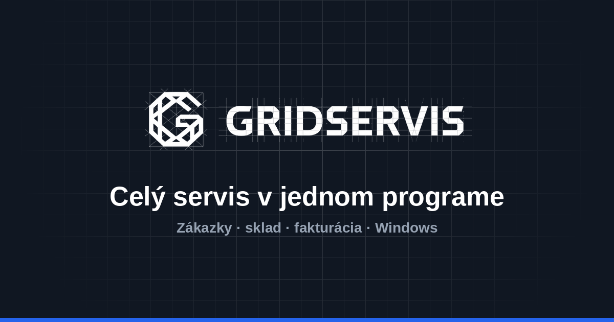
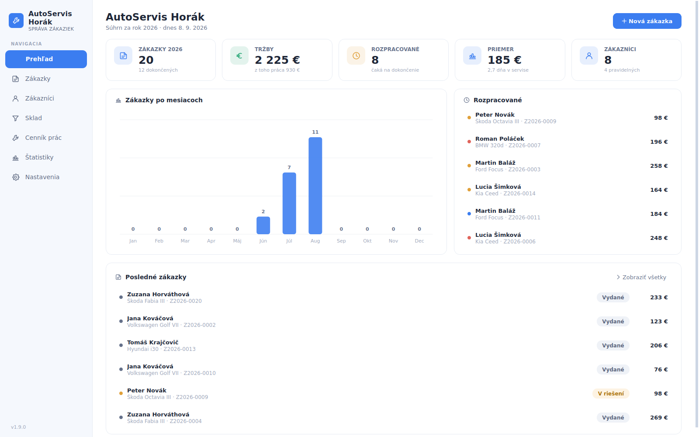
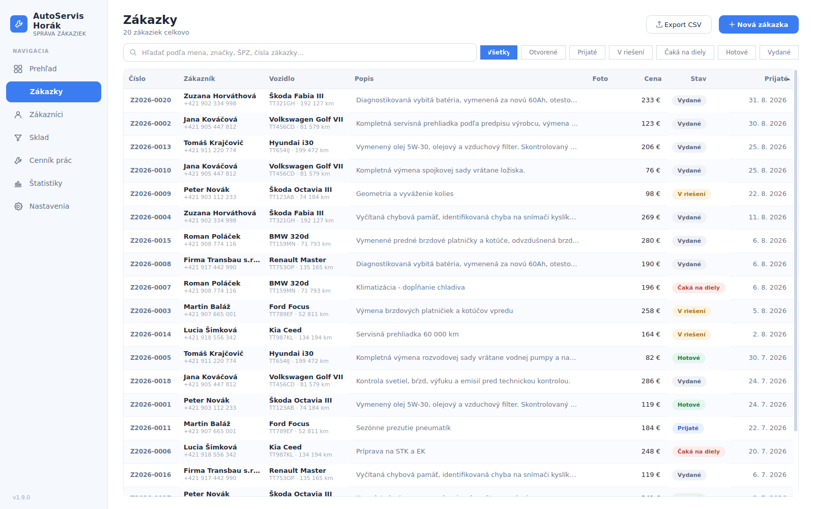
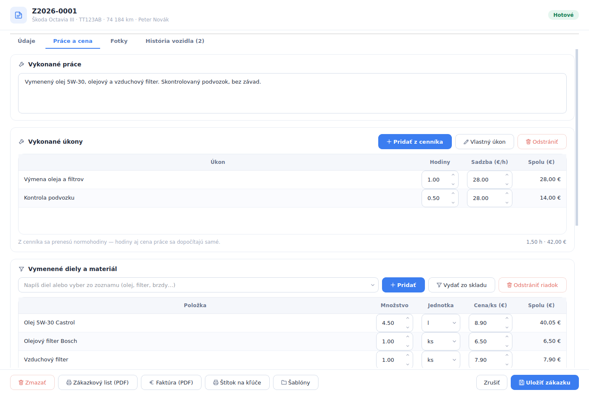
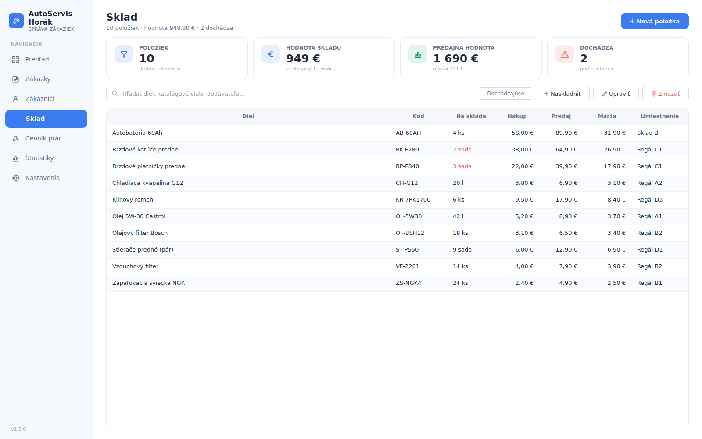
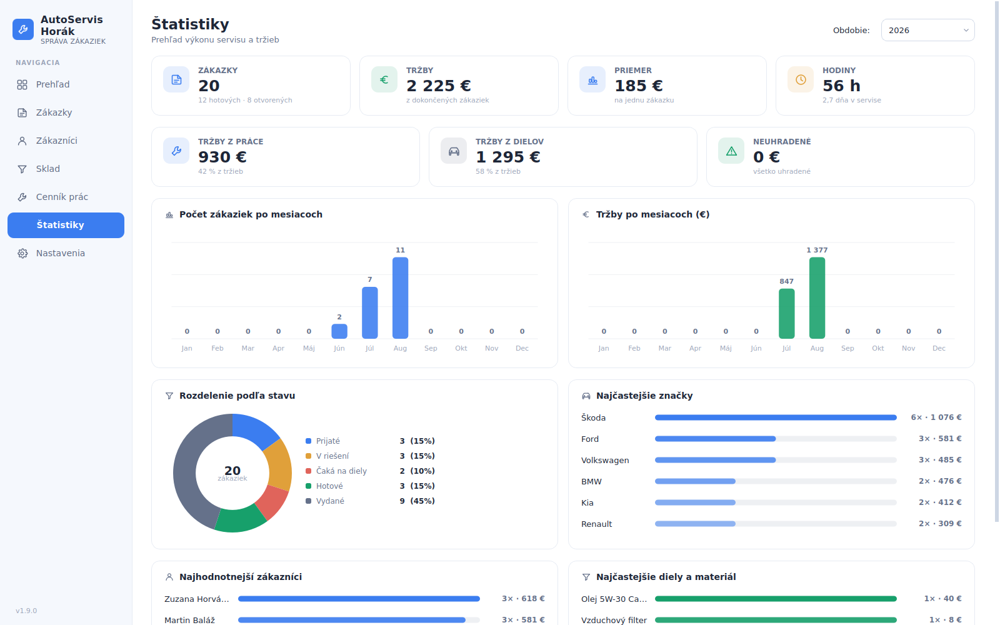
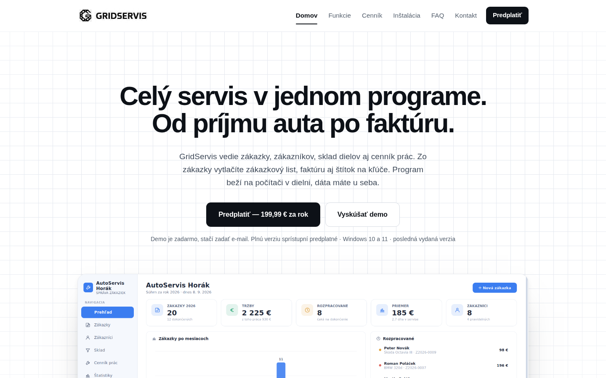
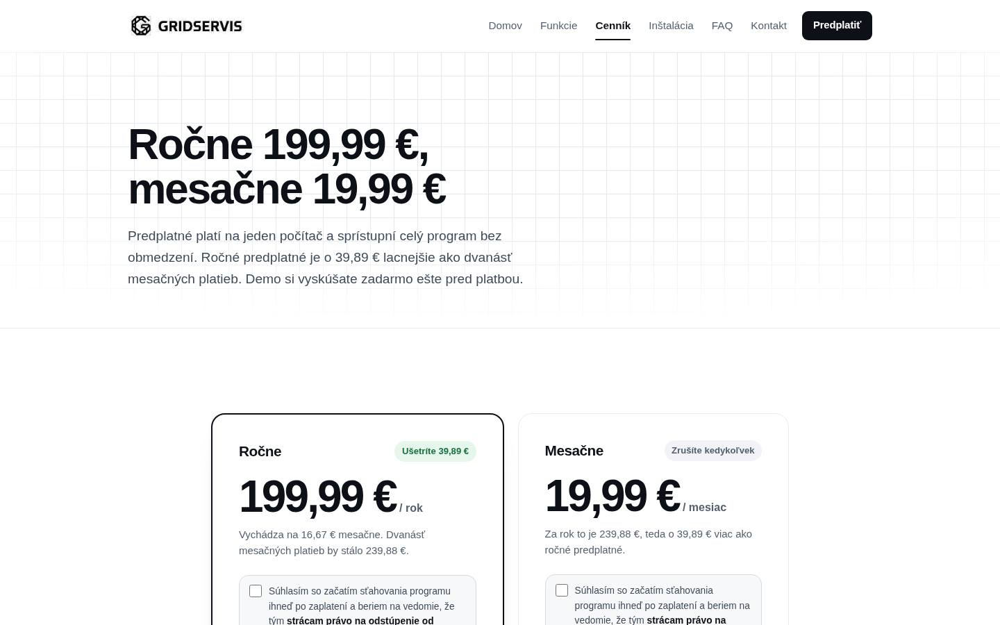

<div align="center">



# GridServis

**Od príjmu auta po faktúru.**
Program na správu autoservisu pre Windows — a web, ktorý ho predáva.

[www.gridservis.app](https://www.gridservis.app)

</div>

---

## Načo to je

Malé a stredné autoservisy vedú zákazky v zošite, v Exceli alebo v esemeskách.
Keď sa po pol roku vráti to isté auto, nikto nevie, čo sa na ňom naposledy robilo.
Na konci mesiaca sa tržby dopočítavajú ručne.

**GridServis** to celé drží na jednom mieste: zákazka obsahuje zákazníka, auto,
popis závady, vykonané úkony z cenníka prác, vymenené diely zo skladu, fotky aj
cenu. Z tej istej zákazky sa vytlačí zákazkový list, faktúra aj štítok na kľúče.

Program beží lokálne na počítači v dielni — **dáta zostávajú u dielne**, nie
v cudzom cloude.

Tento repozitár obsahuje **web** (prezentácia, cenník, predaj predplatného
a stiahnutie inštalačky). Samotný program pre Windows je vyvíjaný samostatne;
web ho len predáva a servíruje jeho vydania.

---

## Program (Windows aplikácia)

Sedem obrazoviek, ktoré pokrývajú bežný deň v dielni.

### Prehľad

Čísla za rok, rozrobené zákazky a posledný pohyb hneď po otvorení.



### Zákazky

Zoznam s filtrami podľa stavu (prijaté, v riešení, čaká na diely, hotové, vydané),
vyhľadávanie podľa mena, značky, ŠPZ aj čísla zákazky, export do CSV.
Číslovanie je automatické v tvare `Z2026-0001`.



### Detail zákazky — práce a cena

Úkony sa ťahajú z cenníka prác aj s normohodinami, diely zo skladu. Cena práce sa
dopočíta zo sadzby dielne. Dole sú tlačidlá na zákazkový list, faktúru a štítok
na kľúče v PDF.



### Sklad

Diely s katalógovým číslom, umiestnením v regáli, nákupnou a predajnou cenou
aj maržou. Program upozorní, čo je pod minimom.



### Štatistiky

Tržby po mesiacoch, pomer práce a dielov, neuhradené, rozdelenie zákaziek podľa
stavu, najčastejšie značky vozidiel aj najhodnotnejší zákazníci.



Okrem toho sú v programe **Zákazníci** (karty s autami, počtom zákaziek a útratou),
**Cenník prác** (úkony v kategóriách s normohodinami) a **Nastavenia** (údaje
dielne do hlavičky dokladov, hodinová sadzba, IBAN, splatnosť, DPH, číslovanie).

---

## Web

Statický web v slovenčine: popis programu, cenník, FAQ, návod na inštaláciu
a nákup predplatného cez Stripe.

| Domov | Cenník |
| --- | --- |
|  |  |

Web nesťahuje **nič z cudzích domén** — žiadne externé písma, analytika ani
vložený obsah. Návštevnosť sa meria vlastným endpointom `/api/udalost`, ktorý
ukladá len typ udalosti a stránku: žiadne cookies, žiadna IP adresa.

### Čo sa deje na pozadí

```
Zákazník na cennik.html
        │  POST /api/checkout          (+ povinný súhlas s okamžitým sťahovaním)
        ▼
    Stripe Checkout
        │
        ├─► POST /api/stripe-hook      webhook: vydá licenciu, pošle kód e‑mailom,
        │                              obnovy a zrušenia predplatného
        └─► hotovo.html
               │  GET /api/pristup     zobrazí kód hneď, aj keď webhook mešká
               └─ GET /api/stiahnut    inštalačka až po dokončenej objednávke

Program v dielni
        ├─ GET  /api/verzia            je nová verzia?
        ├─ POST /api/portal            zrušenie obnovy v Stripe portáli
        └─ obnova.html / presun.html   predĺženie licencie, presun na iný počítač
```

Licenčný kód má tvar `MECH-XXXX-XXXX-XXXX` a platí na jeden počítač. Vydávanie je
odolné voči zopakovaniu — kľúčom je `stripe_id` v tabuľke platieb, takže tá istá
udalosť zo Stripe nikdy nevydá licenciu dvakrát.

Demo je tiež objednávka, len za 0 € — Stripe pri nej nepýta kartu, iba e‑mail.

---

## Štruktúra repozitára

```
.
├── public/            samotný web — to, čo Vercel servíruje
│   ├── *.html         stránky (generované z tools/gen.py)
│   ├── assets/        css, js, obrázky a snímky programu
│   ├── favicon.ico
│   ├── robots.txt
│   └── sitemap.xml
├── api/               serverless funkcie (Vercel ich hľadá v koreni)
├── tools/             generátor stránok a obrázkov, nenasadzuje sa
├── docs/              poznámky k projektu a snímky do tohto README
├── .github/workflows/ zápis nového vydania do databázy po GitHub Release
└── vercel.json        bezpečnostné hlavičky a výstupný adresár
```

Stránky sa **negenerujú pri nasadení** — sú v repe hotové. Generátor
`tools/gen.py` je jediný zdroj textov, cien a navigácie, takže sa čísla na webe
nemajú ako rozísť. Po zmene v generátore sa výsledné HTML commitne spolu s ním.

---

## Lokálny vývoj

```bash
python3 tools/gen.py                  # vygeneruje HTML do public/
cd public && python3 -m http.server 8080
# http://localhost:8080
```

Takto nebežia `/api/*`, takže sa stránky zobrazia bez čísla verzie a stiahnutie
nebude funkčné. Na plnú funkčnosť treba `vercel dev` alebo nasadené preview.

Obrázky, ktoré sa nedajú poskladať v HTML (náhľad do sociálnych sietí a
`favicon.ico`), generuje `tools/obrazky.py`. Spúšťa sa ručne, len keď sa mení
značka:

```bash
pip install pillow
python3 tools/obrazky.py
```

---

## Nasadenie

Vercel, napojený priamo na tento repozitár. Bez build kroku — výstupný adresár je
`public/`, funkcie v `api/` si Vercel nájde sám.

Funkcie potrebujú tieto premenné prostredia:

| Premenná | Načo |
| --- | --- |
| `DATABASE_URL` | licenčná databáza (Neon), rola `web_klient` |
| `STRIPE_SECRET_KEY` | tajný kľúč Stripe |
| `STRIPE_WEBHOOK_SECRET` | overenie podpisu webhooku |
| `STRIPE_PRICE_ROK`, `STRIPE_PRICE_MESIAC` | ceny predplatného |
| `STRIPE_PRICE_DEMO`, `STRIPE_PRICE_PRESUN` | demo (0 €) a presun licencie |
| `RELEASE_REPO`, `RELEASE_ASSET`, `RELEASE_ASSET_DEMO` | odkiaľ sa berie inštalačka |
| `RELEASE_TOKEN` | prístup k súkromnému repu s vydaniami |
| `RESEND_API_KEY`, `RESEND_FROM`, `RESEND_REPLY_TO` | odosielanie licenčných kódov |
| `SITE_URL` | ostrá adresa webu pre návratové odkazy zo Stripe |

Keď chýba `RESEND_API_KEY`, e‑mail sa jednoducho nepošle a licencia sa aj tak
vydá — kód zostáva na stránke po platbe. Odosielanie e‑mailov nikdy nesmie
zhodiť vydanie licencie.

Databázová rola `web_klient` vidí len licencie, platby, návštevnosť a zariadenia.
K zákazníckym dátam dielní sa nedostane, ani keby niekto získal premenné
prostredia.

---

## Vydanie novej verzie programu

1. Na GitHube sprav **Release** s tagom `v2.2.6` a s `GridServisSetup.exe` ako asset.
2. Workflow [`vydaj-verziu.yml`](.github/workflows/vydaj-verziu.yml) spočíta SHA‑256
   a veľkosť a zapíše riadok do tabuľky `verzie`.
3. Verzia sa zapíše ako **neaktívna** — dielňam sa zatiaľ neponúka. Zapneš ju
   v admine, alebo dáš do popisu releasu `[zapnut]`.
4. `[povinna]` v popise znamená, že aktualizáciu nepôjde v programe preskočiť.

---

## Poznámky k projektu

- [`docs/ulohy-pred-spustenim.md`](docs/ulohy-pred-spustenim.md) — čo doriešiť na webe
- [`docs/aplikacia-ulohy.md`](docs/aplikacia-ulohy.md) — čo z toho vyplýva pre program

---

## Kontakt

strananekm@gmail.com
